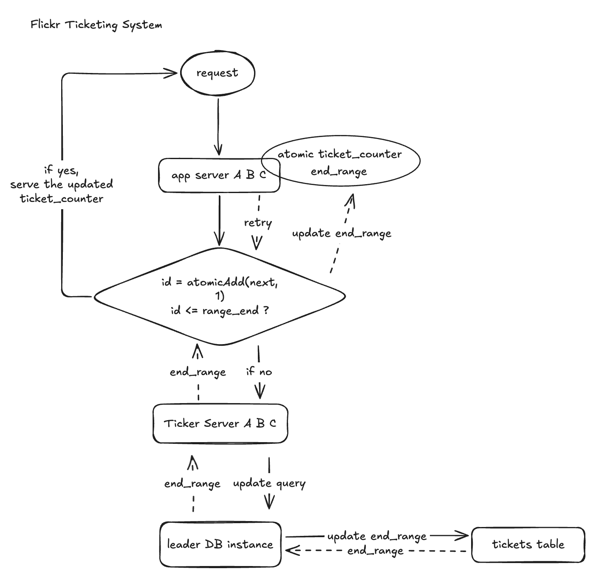

### Design Doc

Task: Deisgn a system to generate a DB-friendly numeric unique id as a canonical id across services for each request. 




---

#### How to avoid race condition in the fast path?
When two goroutines try to grab the current ticket counter, without synchronization, they might both read the same value, which leads to duplicate ID within the same server. To avoid it locally, we need the in-memory pointer to be updated atomically. Although we can use mutex/lock, the lock contention under high concurrency would be bad. A better way is to use atomic increment 
```go
id := atomic.AddInt64(&next, 1) - 1
if id <= rangeEnd {
    return id
} else {
    // fetch a new range and retry.. POSSIBLE RACE CONDITION! Next section
}
```

#### When hitting the slow path, how to avoid multiple threads hitting MySQL and reserving 20 new ranges?
We need one more layer of synchronization - when range is exhausted, one thread grabs a lock and fetches a new range from DB.
```go
// In the app server
type TicketAllocator struct {
    next int64
    end int64
    refillMu sync.Mutex // used in refill
}
```
